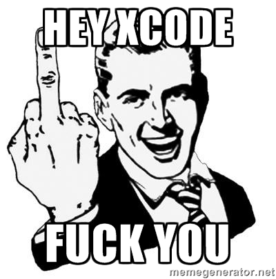
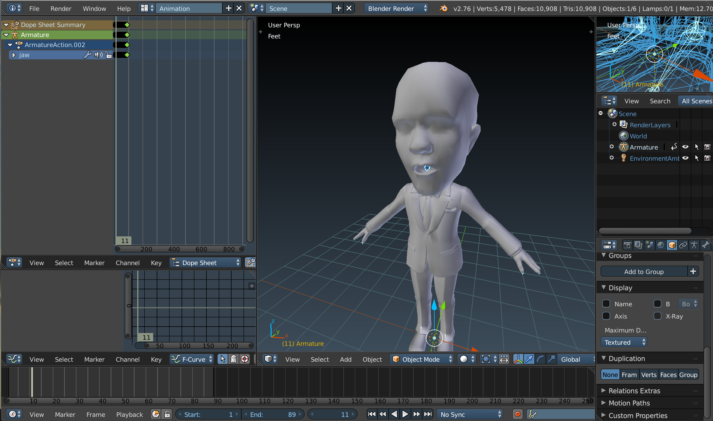

# Fourier Transform in Action

## Intro

- In this talk, I'll use command line tools **only** to compile and run swift code. Because....
    + XCode APP crashes often.
    + XCode APP slow me down in prototyping.
    + XCode APP sucks!


### *A picture is worth a thousand words... :)*
[Pic. Origin](http://memegenerator.net/instance/52113798)

- The tools I will use today is simple. Most of them should be familiar to you:
    + `Makefile` and `make`
    + `xcrun` (XCode in command line)
    + `swift`(REPL) and `swiftc`(compiler)

## Demo

- I use `Blender` and `python` to implement a simple, basic lips syncing algorithm
- It takes a `wav` audio file and output neccessary parameters for lips animation.
- The core of this algorithm is the `FFT`!



## Routine
1. Create Setup
    - According to the [document](https://developer.apple.com/library/ios/documentation/Performance/Conceptual/vDSP_Programming_Guide/USingDFTFunctions/USingDFTFunctions.html#//apple_ref/doc/uid/TP40005147-CH4-SW1), you need to take care of **length** of the input signal.
    - This step is expensive in terms of execution time.
2. Create Output Buffers.
3. Execute FFT.

## Snippets

```{swift}
import Accelerate

var N = 16 // 16 samples
var sig = [Double](count:N, repeatedValue:0)
var zeros = [Double](count:N, repeatedValue:0)

for i in 0..<N{
    sig[i] = Double(i+1)
}

// Create setup
// setup is a struct which contains neccessary information for fft.\
var setup = vDSP_DFT_zop_CreateSetup(nil, vDSP_Length(N), vDSP_DFT_Direction.FORWARD)

// Output buffers
var coef_real = [Double](count:N, repeatedValue:0)
var coef_imag = [Double](count:N, repeatedValue:0)

vDSP_DFT_ExecuteD(setup, &sig, &zeros, &coef_real, &coef_imag)
vDSP_DFT_DestroySetupD(setup)

for i in 0..<N {
    print("\(coef_real[i])" \(coef_imag[i])j")
}
```

## Take Home Message
- Someone's life is better **without** XCode. (Me!)
- A comment in the `vDSP.h` suggests that you should use `vDSP_DFT_XXX` in place of `vDSP_fft_XXX`.
    + To be honest, I don't know why.
    + Let's assume that is true(?)
    + See `/Applications/Xcode.app/Contents/Developer/Platforms/MacOSX.platform/Developer/SDKs/MacOSX10.11.sdk/System/Library/Frameworks/Kernel.framework/Versions/Current/Headers/vecLib/vDSP.h`
- `Accelerate` is fast if you use it in the right way.
    + Otherwise, it is not.
- Fast Fourier Transform is sexy.

