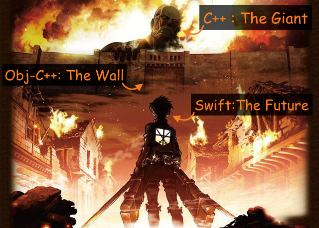

# C++ + Obj-C++ + Swift: EdgeMe

In this talk, I'll show you how to incorporate C++, Obj-C(Obj-C++) and Swift by building a simple app, `EdgeMe`.

## Why Do You Have to Do This?

Good question. 

Why bother to use three different languagues in one project? 

Besides, it is getting worse as C++ gets involved!

As for me, my job is to develop algorithm using ML or image processing technics. 
These tasks rely heavily on matrix computation. 
However, I do not see good library provides me the funcionality I need for matrix computation. 

I told this to one of my collegue and he said:

As a result, I started to work on writing Obj-C++ wrapper for OpenCV in my Swift project.

Finally, I managed to get OpenCV working without bugs.......

 
 
 
 
 
 
 
 
 
 
 
 
 
 
 
 
 
 
 
 
 
 

after about <strong>2 WEEKS</strong>!

## How is It Done?

I think it is better explained with a simple demo. Let's build EdgeMe from scratch. 

In this demo, I will go through following steps, which typically is the same process for you guys who want to use C++ or library written in C++ in your projects.

1. (Optional) Setup the library.
    - You don't have to do this if you are writting your own C++ library.
2. Writting wrapper in Obj-C++.
3. Import wrappers in the bridging header.
4. Calling wrappers in the Swift code.

That's all.

Though as simple as it seem, I still have several bugs as I try to do it in the first time. I will point out what you should keep in mind in the following demo.

## Demo Time

[Final Result (YouTube)](https://youtu.be/ADl2Mxp9sT8)

## Summary

- If you can use `pod` to install the libraries you need, do it. Building from source is for the brave.
  - If it is not for the reason of version control, go for the **latest** version available on `pod`.
- Keep every single C++ code behind Obj-C++ or your Swift code will not compile.
  - Make good use of Obj-C++ extensions.
  - Do not `#import` or `#include` any C++ headers in the wrapper headers. It will break your bridging header.

- Watch out serious side effects.

 
 
Just kidding :P

- Happy coding C++ + Obj-C++ + Swift!
